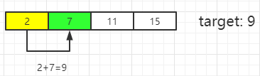
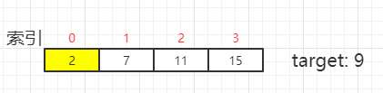
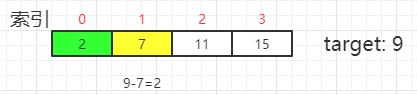

# [目录](../README.md) 

# 一、题目

Given an array of integers `nums` and an integer `target`, return *indices of the two numbers such that they add up to `target`*.

You may assume that each input would have **exactly one solution**, and you may not use the *same* element twice.

You can return the answer in any order.

**Example 1:**

```
Input: nums = [2,7,11,15], target = 9
Output: [0,1]
Output: Because nums[0] + nums[1] == 9, we return [0, 1].
```

**Example 2:**

```
Input: nums = [3,2,4], target = 6
Output: [1,2]
```

**Example 3:**

```
Input: nums = [3,3], target = 6
Output: [0,1]
```

**Constraints:**

- `2 <= nums.length <= 103`
- `-109 <= nums[i] <= 109`
- `-109 <= target <= 109`
- **Only one valid answer exists.**

# 二、解法1：暴力破解法（Brute Force）

## 分析

从一个数组（nums）中找到两个数，这两个数的和等于 target。那么就可以一个一个地试，从第一个元素开始，判断后面的数和它相加是否等于target。这里有个地方需要注意：（1）根据题目 **Only one valid answer exists **的意思，所以必然存在且仅存在一个解。

示例：`nums = [2,7,11,15], target = 9`

（1）从第 1 个数2开始，逐个与后面的数相加判断是否等于 9 。



因为 2 + 7 刚好等于9，所以将元素 2 和 7 的索引存储到列表中，并将该列表返回即可。

（2）因为要返回的是索引，所以循环的时候应该使用数组的索引进行循环。

## 算法实现

```
class Solution:
    def twoSum(self, nums: List[int], target: int) -> List[int]:
        # 暴力破解法
        # len()方法时间复杂度是O(1)
        n = len(nums)
        # 因为要返回的是索引，所以应该使用数组的索引进行循环
        for i in range(n):
            for j in range(i + 1, n):
                if nums[i] + nums[j] == target:
                    return [i, j]
            
```

## 复杂度

- 时间复杂度：O(n^2)​

- 空间复杂度：O(1)。

  因为额外的空间只是[i，j]，无论数组多大，都是只存储两个元素，所以时间复杂度是 O(1)。

# 三、解法2：哈希表

## 分析

这题涉及到一个判断是否存在的问题，判断是否存在使用哈希表是最快的，因为时间复杂度是：O(1)。所以可以在遍历的时候把元素作为键，把索引作为值存到字典中。然后遍历下一个元素 elem 的时候判断其是否存在于字典中，如果存在，则找到了。

示例：`nums = [2,7,11,15], target = 9`

（1）遍历第一个元素2， 不存在于字典中，所以把{2, 0}存到字典中。

```
dct = {2:0,}
```



（2）遍历第二个元素 7，9 - 7 = 2，判断 2 是否存在于字典中，存在，返回索引，结束遍历。



## 算法实现

```
class Solution:
    def twoSum(self, nums: List[int], target: int) -> List[int]:
        # 哈希表
        dct = {}
        for i, v in enumerate(nums):
            if target - v in dct:
                return [dct[target - v], i]
            dct[v] = i
```

# 四、数据结构与算法

## 数据结构

1、顺序表：list

2、哈希表：dict

## 算法

1、暴力破解法。

# [目录](../README.md) 


   


