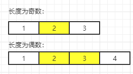

# [目录](../README.md) 

# 一、题目
4. Median of Two Sorted Arrays

Given two sorted arrays `nums1` and `nums2` of size `m` and `n` respectively, return **the median** of the two sorted arrays.

**Follow up:** The overall run time complexity should be `O(log (m+n))`.

**Example 1:**

```
Input: nums1 = [1,3], nums2 = [2]
Output: 2.00000
Explanation: merged array = [1,2,3] and median is 2.
```

**Example 2:**

```
Input: nums1 = [1,2], nums2 = [3,4]
Output: 2.50000
Explanation: merged array = [1,2,3,4] and median is (2 + 3) / 2 = 2.5.
```

**Example 3:**

```
Input: nums1 = [0,0], nums2 = [0,0]
Output: 0.00000
```

**Example 4:**

```
Input: nums1 = [], nums2 = [1]
Output: 1.00000
```

**Example 5:**

```
Input: nums1 = [2], nums2 = []
Output: 2.00000
```

**Constraints:**

- `nums1.length == m`
- `nums2.length == n`
- `0 <= m <= 1000`
- `0 <= n <= 1000`
- `1 <= m + n <= 2000`
- `-106 <= nums1[i], nums2[i] <= 106`


# 二、解法1：暴力破解法

## 分析

设**有序**序列 S 的长度为 n，根据**中位数^[1]^**（median）的定义可得：

（1）n为奇数，median = S~(n+1)/2~。

（2）n为偶数，median = (S~n/2~ + S~n/2+1~) + 1

对于本题，实现流程是：

（1）把两个序列num1, nums2 合并，得到新的序列 nums。

（2）将 nums 排序。

（3）判断 nums 的长度是奇数还是偶数，从而得出中位数。

- 缺点
  - 没有用到数组有序的这一条件。

## 算法实现

```
class Solution:
    def findMedianSortedArrays(self, nums1: List[int], nums2: List[int]) -> float:
        # 自定义
        nums = nums1 + nums2
        nums.sort()
        n = len(nums)
        ans = 0
        # 数组长度是偶数
        if n % 2 == 0:
            ans = (nums[n // 2 - 1] + nums[n // 2]) / 2
        # 数组长度是奇数
        else:
            ans = nums[n // 2]
        return ans
```

## 复杂度

- 时间复杂度：O(nlogn)​。
- 空间复杂度：O(n)。

# 三、解法2：二分查找

## 分析



## 算法实现

```

```

## 复杂度

- 时间复杂度：O(n)​，具体来说是 O(logmin(m + n))。
- 空间复杂度：O(n)，具体来说是 O(1)。

# 数据结构与算法

## 数据结构

1、顺序表：list。

## 算法

1、

# 参考资料

[1]中位数：https://baike.baidu.com/item/%E4%B8%AD%E4%BD%8D%E6%95%B0

# [目录](../README.md) 


   


